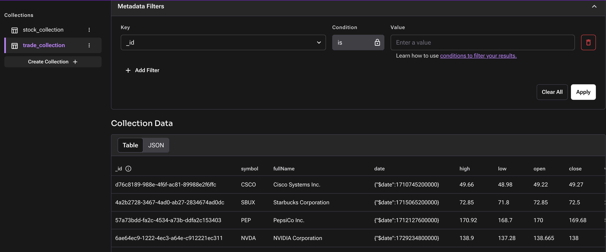

# NoSQL workshop

In this workshop, you will build an app to display stock market data.

First, you will use the Data API and collections to build the app.
Then, you will use the Data API and tables to build the app.

todo more info about what they will learn/why this is something our users care about

TODO workshop presenter should give a quick demo of the app. Could add a movie to the readme too.

## Copy the base components of the app

To focus on learning how to use the Data API to interact with data, we have created the app UI for you. We have also provided you with data files.

TODO make a branch with just the starting files

TODO briefly describe the starting files. (Yuqi's original readme has a nice outline already.)

TODO run prettier on the starting files

## Install the requirements

Run `npm install` to install the requirements for the app. [TODO if we are having them use codespaces, this might run automatically when the codespace starts.]

TODO maybe talk about the requirements here? Or just mention that this project uses the TS datastax client.

## Create a database and store your credentials

TODO do all participants already have a database?

1. Create a `.env` file at the root of your project. You can copy `.env.example` as an example. [TODO could we just give them a .env file as one of the starting files and have them just replace placeholders?]
1. In the [Astra Portal](https://astra.datastax.com/), navigate to your database.
1. Under **Database Details** in the portal, copy your database's API endpoint.
1. Store this value in a variable called `ASTRA_URI` in your `.env` file. [TODO super minor: if this app uses `ASTRA_DB_API_ENDPOINT` as the var name, it will align with the docs convention]
1. Under **Database Details** in the portal, click **Generate Token**, then copy the token.
1. Store this value in a variable called `ASTRA_TOKEN` in your `.env` file. [TODO super minor: if this app uses `ASTRA_DB_APPLICATION_TOKEN` as the var name, it will align with the docs convention]

## Look at the data

Before adding data to your database, take a look at the structure of the data that you will be adding.

[TODO describe the data structure]

## Collections journey

Collections are good for data that is not fully structured, or for cases where you do not want to use a fixed schema

TODO right now the app uses the `USE_COLLECTION` env var. I think this is a cool toggle and makes it easy to see when you do one thing vs another for tables vs collections, but it also adds complexity for people trying to read the code. What do we think about not having that toggle? If we decide to keep it, tell users here to set the var.

### Write an interface to represent the data

TODO this is more of a TS thing than a datastax thing. Do we just want to provide the `Trade` and `Stock` interfaces for them? Either way, we should explain that this is just good TS practice, but isn't required (e.g. you could have a very open-ended document structure and just use `Any`). Also, either way, we should align on what we want to store in the database (e.g. we could store one document per stock, or one document per trade. In this workshop, we are going to do both, across 2 collections.)

### Write a function to connect to your database

To use the Data API via the TypeScript client, you need to initialize the client. Then, you need to get your database.

The function should:

1. Get the database endpoint and application token from the your .env file
1. Create an instance of the `DataAPIClient` class (from the `@datastax/astra-db-ts` library) with your token.
1. Get and return the database specified by your endpoint.

TODO the `getAstraClient` function returns a database, but the name makes it sound like it returns a client. It also might be nice to have the constants in the `src/lib/astradb.ts` file scoped to that function?

TODO show the final function here so they can compare.

### Write a function to add stock data to a collection

The function should:

1. Create a collection.

   Hint: Use the `createCollection` method. TODO add link to the docs and maybe put this hint under a collapsible.

1. For every row in the `nasdaq_stocks.csv` file, add a document to the collection.

Bonus: Make your function catch errors when reading the CSV file or inserting data.

TODO show the final function here so they can compare.

### Write a function to add trade data to a collection

The function should:

1. Create a collection.

   Hint: Use the `createCollection` method. TODO add link to the docs and maybe put this hint under a collapsible.
1. For every stock, for every trade of that stock (every row in the corresponding CSV file), insert a document to the collection.

   Hint: Iterate over the data files. Read each file row by row. For each row, parse the row into a JSON object (a document). You should convert strings to proper data types like ints and dates when relevant. Build a JSON array of these JSON objects. Then use `insertMany`

Bonus: Make your function catch errors when reading the CSV file or inserting data.

TODO show the final function here so they can compare.

TODO for timing reasons, should we just have them write one of these functions? Or should we just timebox them and give them the solution after x minutes?

### Hook up your functions

You want to run these functions once, to insert the data to your database.

TODO do we want to tell people to do this, or do we want to just rely on the checkpoint alignment below?

### Checkpoint

TODO have a branch that people can check out so everyone is on the same page. The branch should have the functions to add data to the collection written already.

Also tell people about the extra things we added, like deleting existing data.

If we don't want to tell people to do this, we need to be very prescriptive above about what collection name and document structure to use, function names, etc.

### Run your functions

TODO tell people to run `npm run seed` (or some other command, if we split up the table and collection logic as proposed above.) Alternatively, we could put a "initialize data" button in the UI.

### Inspect your data

1. In the [Astra Portal](https://astra.datastax.com/), navigate to your database.
1. You should see two collections, one with the stock symbols and names, and one with the trade data.

Congrats! You now have data in your database.

### Write functions

Now that you have data in your database, you can write functions to use the data.

TODO lead the user through writing the `getStocksFromAstra` and `getTradesFromAstra` functions.

### Hook up your functions

You want to run these functions to populate the app UI with stock and trade info.

TODO do we want to tell people to do this, or do we want to just rely on the checkpoint alignment below?

### Checkpoint

TODO have a branch that people can check out so everyone is on the same page. The branch should have the functions to fetch data from the collection written already.

Also tell people about the extra things we added, like the UI code.

If we don't want to tell people to do this, we need to be very prescriptive above about function names and locations, etc.

### Run the app

Run `npm run dev`, then navigate to `http://localhost:3000`.

## Tables journey

Tables are good if your data is fully structured and you want to use a fixed schema.

TODO same question as above about the `USE_COLLECTION` toggle.

TODO add steps to have the user write the data api functions for the table version of the app.

## Next steps

### Deploy your app

TODO include the steps from Yuqi's original readme. I'm not sure if there will be time for this in the workshop though, especially if we want people to have time to explore the data API. Can wait to use list the vercel account prereq until here.
